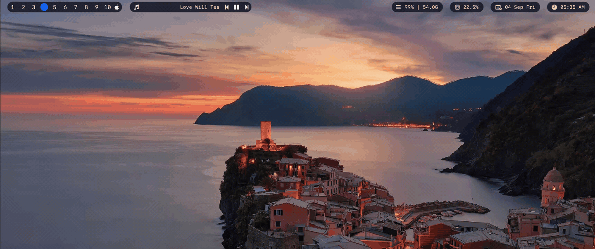

# sketchybar-now-playing

[](https://crates.io/crates/sketchy-playing)
[](https://github.com/wthrajat/sketchybar-now-playing/actions/workflows/ci.yml)
[](https://github.com/wthrajat/sketchybar-now-playing/blob/main/LICENSE)

Show what is playing on macOS in SketchyBar. Spotify, Apple Music,
browser tabs with video or music, and anything else that appears in
Control Center.

One small Rust binary plus two shell scripts. It is event driven, so it
idles at zero CPU and updates the bar the moment the track changes.



## Features

* Current title and artist in the bar, with a per player icon
* Transport buttons `label | prev play/pause next`, each clickable
  and grouped in one bracket pill
* Play, pause, toggle, next and previous controls
* Left click toggles, right click skips to the next track
* Sticky last track: full-pill placeholder when idle, real track while
  playing or paused; scroll runs only while playing, never hiding
* Native bar scrolling for long titles, on only while playing
* JSON output and a live change feed for scripting

## Requirements

* macOS 13 or later (tested on macOS 26)
* [SketchyBar](https://github.com/FelixKratz/SketchyBar) installed and running
* Rust 1.75 or later, only for source builds
* A Nerd Font in the bar config, only needed for the player icons

## Install

**Install** from crates.io:

```sh
cargo install sketchy-playing
```

**Update**:

```sh
cargo install sketchy-playing --force
```

Or straight from GitHub (latest `main`, useful when crates.io lags behind):

```sh
cargo install --git https://github.com/wthrajat/sketchybar-now-playing --force
```

No Rust toolchain? Use the one liner with prebuilt binaries from the
[releases page](https://github.com/wthrajat/sketchybar-now-playing/releases):

```sh
curl -fsSL https://raw.githubusercontent.com/wthrajat/sketchybar-now-playing/main/install.sh | sh
```

From source:

```sh
git clone https://github.com/wthrajat/sketchybar-now-playing.git
cd sketchybar-now-playing
cargo build --release --locked
mkdir -p ~/.local/bin
install -m 755 target/release/sketchybar-now-playing ~/.local/bin/
```

Install the binary with an atomic rename. Never copy over the
destination in place while the bar may be executing it, or macOS can
refuse to launch that file path afterwards. `install` and `mv` are
atomic. Bare `cp` onto a live path is not.

Confirm it sees your media (play something first):

```sh
sketchybar-now-playing get
sketchybar-now-playing get --json
```

Example output:

```sh
Alfred Hall - Pearl Diver - 777tv
{"title":"Alfred Hall - Pearl Diver","artist":"777tv","bundle_id":"org.mozilla.firefox","playing":true}
```

## Integrate with SketchyBar

There are two parts: the bar item (what you see) and the daemon
(what watches for track changes). The steps below wire both.

### 1. Copy the scripts

Shell setup (Lua users skip to step 5):

```sh
cp plugins/now_playing.sh ~/.config/sketchybar/plugins/now_playing.sh
cp items/now_playing.sh ~/.config/sketchybar/items/now_playing.sh
chmod +x ~/.config/sketchybar/plugins/now_playing.sh
```

### 2. Source the wiring from sketchybarrc

Add this after your bar setup, before the final `sketchybar --update`:

```sh
source "$HOME/.config/sketchybar/items/now_playing.sh"
```

That one line does all of the following: it creates a custom
`now_playing_change` event, adds a `now_playing` item on the right side,
subscribes it to the event and to mouse clicks, enables native scrolling,
and starts the daemon if it is not already running. It also adds the
transport buttons (`now_playing.sep`, `.prev`, `.toggle`, `.next`) grouped
in a `now_playing_bracket` pill, so the bar reads
`♪ Title - Artist | ⏮ ▶ ⏭` with every button clickable. The play button
follows playback and swaps between play and pause.

To keep just the single track item with no buttons:

```sh
NOW_PLAYING_CONTROLS=0 source "$HOME/.config/sketchybar/items/now_playing.sh"
```

For the solid pill background from the screenshot, style the bracket once
after sourcing:

```sh
sketchybar --set now_playing_bracket background.color=0xff2b3a55 \
  background.corner_radius=6 background.height=26
```

### 3. Reload the bar

```sh
sketchybar --reload
```

Play a song or video. The bar shows the label within a moment.

### 4. Manual setup (alternative)

If you prefer explicit config over the sourced script, put this in
`sketchybarrc`:

```sh
PLUGIN_DIR="$HOME/.config/sketchybar/plugins"
BIN="$HOME/.local/bin/sketchybar-now-playing"

sketchybar --add event now_playing_change \
  --add item now_playing right \
  --set now_playing \
    script="$PLUGIN_DIR/now_playing.sh" \
    click_script="$PLUGIN_DIR/now_playing.sh" \
    update_freq=10 \
    scroll_texts=off \
    drawing=off \
    label.max_chars=40 \
    label.scroll_duration=100 \
  --subscribe now_playing now_playing_change mouse.clicked

pgrep -f "[s]ketchybar-now-playing daemon" >/dev/null 2>&1 || \
  "$BIN" daemon --event now_playing_change >>/tmp/sketchybar-now-playing.log 2>&1 &
```

### 5. Lua setup (SbarLua)

For Lua based configs, use `items/now_playing.lua` instead of the shell
scripts:

```sh
cp items/now_playing.lua ~/.config/sketchybar/items/now_playing.lua
```

Load it from `init.lua` after the bar setup, then autostart the daemon
once (the `pgrep` guard keeps reloads from stacking daemons):

```lua
require("items.now_playing")

sbar.exec("pgrep -f '[s]ketchybar-now-playing daemon' >/dev/null || "
  .. "sketchybar-now-playing daemon >>/tmp/sketchybar-now-playing.log 2>&1 &")
```

The item subscribes to the same `now_playing_change` event, so the Rust
daemon works unchanged. Click and polling fallback behavior match the
shell plugin.

### 6. Tune with environment variables

The sourced wiring script reads these optional variables:

| Variable          | Default              | Purpose                              |
| ----------------- | -------------------- | ------------------------------------ |
| `NOW_PLAYING_BIN` | auto resolved | Explicit binary path. Otherwise `PATH`, then `~/.cargo/bin`, `~/.local/bin`, `/opt/homebrew/bin`, `/usr/local/bin` |
| `NOW_PLAYING_CONFIG` | unset | Config file forwarded to every binary call |
| `NOW_PLAYING_POS` | `right`              | Bar position of the item             |
| `NOW_PLAYING_EVENT` | `now_playing_change` | Custom event name                  |
| `NOW_PLAYING_MAX` | `40`                 | Chars before the label scrolls       |
| `NOW_PLAYING_CONTROLS` | `1`           | Set to `0` for the track item only, no transport buttons |

### Polling fallback

When the daemon runs, the item updates through events and costs nothing
while idle. If the daemon is ever absent, the same item falls back to
`update_freq` polling through `sync`, which pushes label, icon and
scroll state in one call, showing the placeholder on idle. The same
call reconverges a freshly reloaded item within one tick.

## Configuration

Copy the example and pass it with `--config`:

```sh
cp config.example.toml ~/.config/sketchybar/now-playing.toml
```

```toml
separator = " - "
hide_output = false
max_chars = 20
# static_icon = ""

[icons]
"com.spotify.client" = ""
```

`separator` joins the fields. The bar item never hides: idle shows the
placeholder pill, playing or paused shows the real track (`scroll_texts`
runs only while playing). `hide_output` prints an empty line instead of a placeholder from
`get` when nothing plays. `static_icon` pins one glyph
for every player instead of the per player map. Entries under `[icons]`
map a player bundle id to a glyph and win over the built ins. To always show
the music note instead of the browser glyph (e.g. for Firefox tabs),
override that bundle id:

```toml
[icons]
"org.mozilla.firefox" = ""
```

## Commands

| Command    | Purpose                                              |
| ---------- | ---------------------------------------------------- |
| `get`      | Print the current track once                         |
| `get --json` | Print it as compact JSON, `null` when idle        |
| `stream`   | Print a JSON line per change, for pipes and scripts  |
| `daemon`   | Push changes into SketchyBar in a loop               |
| `daemon --set ITEM` | Update the item directly, no event needed   |
| `sync ITEM`    | Snapshot once and push label, icon and scroll state into ITEM |
| `play`, `pause`, `toggle`, `next`, `prev` | Control playback |

Every command accepts a global `--config PATH` flag.

## Click behavior

| Click        | Action               |
| ------------ | -------------------- |
| Left (label) | Toggle play and pause |
| Right (label) | Skip to next track  |
| Prev button  | Previous track       |
| Play/pause button | Toggle play and pause |
| Next button  | Skip to next track   |

While the placeholder shows (no player loaded) every click is ignored,
so a stray toggle can never wake Apple Music.

Set the binary location for clicks with `NOW_PLAYING_BIN` if it is not
on the default `PATH` inside SketchyBar.

## Performance

Measured live on Apple Silicon (`arm64`), macOS 26.3, daemon uptime 2+
days with music playing. RSS includes shared system libraries; private
(`top` MEM) is the unshared cost:

| Process | RSS | Private | CPU |
| ------- | --- | ------- | --- |
| Daemon | ~14.5 MB | ~3.9 MB | 0.0% (sampled and lifetime avg) |
| Media helper (`perl` adapter) | ~19 MB | ~7.6 MB | 0.0% |
| **Steady state total** | **~33 MB** | **~11.5 MB** | **~0%** |
| One `get` snapshot (one-shot) | ~22 MB peak | ~3.3 MB own footprint | ~0.03s CPU, 0.09s wall |

Binary: **1,200,880 bytes (~1.1 MiB)**, release build with LTO + `strip`.

Why it stays light:

* Event driven. The daemon sleeps until MediaRemote reports a change,
  so steady state costs zero CPU.
* The 10s `sync` tick is skipped while the daemon is alive (one `pgrep`
  instead of a snapshot), so a healthy setup pays nothing between track
  changes. It only polls as a fallback when the daemon is gone.
* One `sketchybar` spawn covers the whole pill (label + 4 controls),
  and bursts coalesce to the latest state, so scrubbing never causes a
  spawn storm.
* One notification diff per change, O(1) field comparison, and the bar
  is only touched when something actually changed.
* Buttons never poll. The main item's single `sync` tick fans out to
  them, replacing five timers with one.
* One helper process exists per daemon, reaped in a single `pkill` on
  exit, so restarts never leak processes.
* Singleton per feed: a second daemon for the same event/item exits
  immediately instead of doubling memory (~33 MB) and firing every bar
  trigger twice.

## Development

Local setup, architecture, troubleshooting and the release process live
in [docs/development.md](docs/development.md).

## License

MIT. See [LICENSE](LICENSE).
